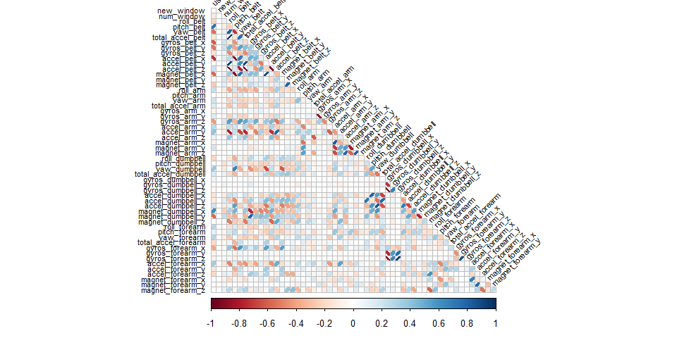
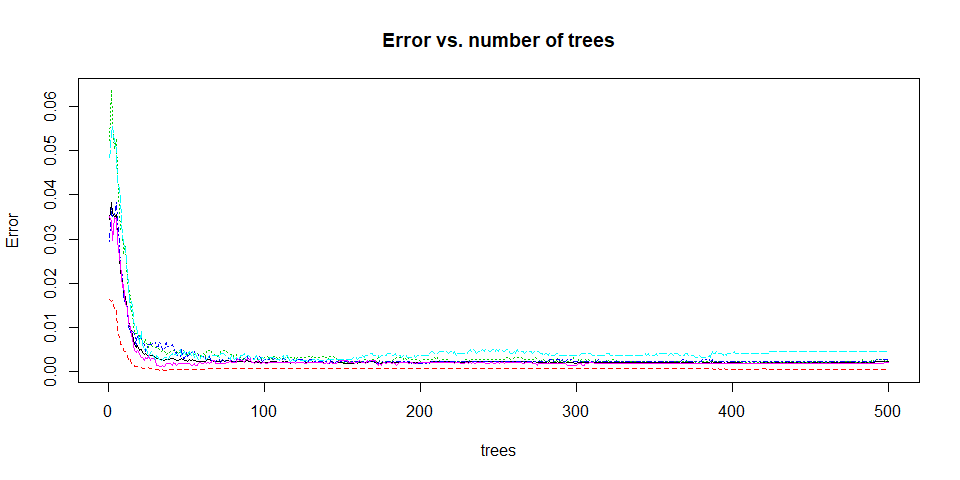

# Executive Summary

The Weight Lifting Exercise Dataset will be used to build a predictive model to predict the manner in which 6 people executed exercises wearing accelerometers on the belt, forearm, arm, and dumbel while performing barbell lifts, which is given by the "classe" variable.

Building the predictive model followed these steps:

* Data cleaning and preparation,
* Exploratory data analysis,
* Pre-processing,
* Model training and validation,
* Predicting the classification in the test set.


# Data source
The data for this project come originally from this source: http://groupware.les.inf.puc-rio.br/har. [1] 

The training data for this project were prepared by Coursera and are available here:

https://d396qusza40orc.cloudfront.net/predmachlearn/pml-training.csv

The test data which will be used to answer 20 cases are available here:

https://d396qusza40orc.cloudfront.net/predmachlearn/pml-testing.csv

# Data cleaning and preparation


```r
train_orig <- read.csv("pml-training.csv", stringsAsFactors = FALSE, na.strings=c("", "NA", "#DIV/0!"))
test_orig <- read.csv("pml-testing.csv", stringsAsFactors = FALSE, na.strings=c("", "NA", "#DIV/0!"))
dim(train_orig) #Dimensions
```

```
## [1] 19622   160
```

```r
dim(test_orig) #Dimensions
```

```
## [1]  20 160
```

```r
#head(train_orig) #excluded from knitr execution due to output size
#str(train_orig) #excluded from knitr execution due to output size
#summary(train_orig) #excluded from knitr execution due to output size
```
A lot of variables contain a great number of NA. Remove these columns first:

```r
rows_count <- nrow(train_orig)
max_na <- rows_count * 0.1 #90% of the data should not be NA
cols_to_remove <- colSums(is.na(train_orig)) > max_na
train_clean <- train_orig[,!cols_to_remove]
test_clean <- test_orig[,!cols_to_remove]
```

Remove other columns that we expect not to use:

```r
timestamps <- grep("timestamp", names(train_clean))
train_clean <- train_clean[,-c(1, timestamps)]
test_clean <- test_clean[,-c(1, timestamps)]
```

Convert character vectors to factors:

```r
train_clean$classe <- factor(train_clean$classe)
train_clean$user_name <- factor(train_clean$user_name)
user_name_lvls <- levels(train_clean$user_name)
train_clean$new_window <- factor(train_clean$new_window)
new_window_lvls <- levels(train_clean$new_window)
test_clean$user_name <- factor(test_clean$user_name, levels=user_name_lvls)
test_clean$new_window <- factor(test_clean$new_window, levels=new_window_lvls)
```

# Exploratory data analyses 

The test set provided by Coursera is the test set to be used for the ultimate evaluation of the model. Therefore we will only use the trainset for training and testing during model building proces.


```r
set.seed(11223344)
classe_col_idx <- which(names(train_clean) == "classe")
in_train <- createDataPartition(y=train_clean$classe, p=0.75, list=FALSE)
mod_train <- train_clean[in_train, ]
mod_test <- train_clean[-in_train, ]
```

Trying to find variables which are correlated to 'classe'?

```r
classe_corr <- cor(data.matrix(mod_train[, -classe_col_idx]), as.numeric(mod_train$classe))
classe_corr[abs(classe_corr) > 0.3,]
```

```
## pitch_forearm 
##     0.3458645
```

A correlation matrix might help to identify highly correlated features. During model selection they might be excluded.

```r
cm <- cor(data.matrix(mod_train[, -classe_col_idx])) #calculate correlation matrix
corrplot(cm, type="lower", tl.cex=0.70, tl.col="black", tl.srt = 45, diag = FALSE, method="ellipse")
```

<!-- -->

Some features appear highly correlated.

# Pre-processing

We will use the `preProcess` function from the caret packet to apply pre-processing transformations and variable selection:

```r
# exclude variables that are highly correlated and
# center and scale the variables
ppm <-preProcess(mod_train[,-classe_col_idx],method=c("corr", "center", "scale"))
mod_train_pp <- predict(ppm, mod_train[,-classe_col_idx])
mod_train_pp$classe <- mod_train$classe

mod_test_pp <- predict(ppm, mod_test[,-classe_col_idx])
mod_test_pp$classe <- mod_test$classe
```

# Model training and validation

Four different models are trained and validated. Applying 5-fold cross-validation should avoid overfitting.

## Decision Tree


```r
dct <- NULL
start <- proc.time()
dct_train <- train(classe ~.,
                  method="rpart", #decision tree
                  data=mod_train_pp, #pre-processed train data
                  trControl=trainControl(method='cv', number=5, 
                                         allowParallel=TRUE))
dct$time <- (proc.time() - start)[3] # elapsed time
dct_train
```

```
## CART 
## 
## 14718 samples
##    48 predictor
##     5 classes: 'A', 'B', 'C', 'D', 'E' 
## 
## No pre-processing
## Resampling: Cross-Validated (5 fold) 
## Summary of sample sizes: 11774, 11775, 11774, 11775, 11774 
## Resampling results across tuning parameters:
## 
##   cp          Accuracy   Kappa    
##   0.03303902  0.5552386  0.4365173
##   0.03987468  0.4970118  0.3477308
##   0.06662394  0.3966546  0.1851091
## 
## Accuracy was used to select the optimal model using the largest value.
## The final value used for the model was cp = 0.03303902.
```

## Gradient Boosting


```r
gbm <- NULL
start <- proc.time()
gbm_train <- train(classe ~.,
                  method="gbm", #gradient boosting
                  data=mod_train_pp, #pre-processed train data
                  trControl=trainControl(method='cv', number=5, 
                                         allowParallel=TRUE),
                  verbose=FALSE)
gbm$time <- (proc.time() - start)[3] # elapsed time
gbm_train
```

```
## Stochastic Gradient Boosting 
## 
## 14718 samples
##    48 predictor
##     5 classes: 'A', 'B', 'C', 'D', 'E' 
## 
## No pre-processing
## Resampling: Cross-Validated (5 fold) 
## Summary of sample sizes: 11774, 11775, 11774, 11774, 11775 
## Resampling results across tuning parameters:
## 
##   interaction.depth  n.trees  Accuracy   Kappa    
##   1                   50      0.7505780  0.6835468
##   1                  100      0.8238214  0.7769337
##   1                  150      0.8666261  0.8311817
##   2                   50      0.8878925  0.8580736
##   2                  100      0.9396662  0.9236539
##   2                  150      0.9632426  0.9534915
##   3                   50      0.9324638  0.9144983
##   3                  100      0.9711244  0.9634610
##   3                  150      0.9853924  0.9815196
## 
## Tuning parameter 'shrinkage' was held constant at a value of 0.1
## Tuning parameter 'n.minobsinnode' was held constant
##  at a value of 10
## Accuracy was used to select the optimal model using the largest value.
## The final values used for the model were n.trees = 150, interaction.depth = 3, shrinkage = 0.1 and n.minobsinnode = 10.
```

## Linear Discriminant Analysis


```r
lda <- NULL
start <- proc.time()
lda_train <- train(classe ~.,
                  method="lda", #linear discriminant analysis
                  data=mod_train_pp, #pre-processed train data
                  trControl=trainControl(method='cv', number=5, 
                                         allowParallel=TRUE),
                  verbose=FALSE)
lda$time <- (proc.time() - start)[3] # elapsed time
lda_train
```

```
## Linear Discriminant Analysis 
## 
## 14718 samples
##    48 predictor
##     5 classes: 'A', 'B', 'C', 'D', 'E' 
## 
## No pre-processing
## Resampling: Cross-Validated (5 fold) 
## Summary of sample sizes: 11774, 11776, 11774, 11776, 11772 
## Resampling results:
## 
##   Accuracy   Kappa    
##   0.7094041  0.6318673
```

## Random Forest


```r
rdf <- NULL
start <- proc.time()
rdf_train <- train(classe ~.,
                  method="rf", #random forest
                  data=mod_train_pp, #pre-processed train data
                  trControl=trainControl(method='cv', number=5, 
                                         allowParallel=TRUE),
                  verbose=FALSE)
rdf$time <- (proc.time() - start)[3] # elapsed time
rdf_train
```

```
## Random Forest 
## 
## 14718 samples
##    48 predictor
##     5 classes: 'A', 'B', 'C', 'D', 'E' 
## 
## No pre-processing
## Resampling: Cross-Validated (5 fold) 
## Summary of sample sizes: 11773, 11776, 11775, 11774, 11774 
## Resampling results across tuning parameters:
## 
##   mtry  Accuracy   Kappa    
##    2    0.9917110  0.9895134
##   27    0.9968067  0.9959607
##   52    0.9944971  0.9930389
## 
## Accuracy was used to select the optimal model using the largest value.
## The final value used for the model was mtry = 27.
```

## Model validation

Applying the fitted models on the test data set, to check accuracy and estimated out of sample error.


```r
dct_test <- predict(dct_train, mod_test_pp)
dct_conf_mat <- confusionMatrix(mod_test_pp$classe, dct_test)
dct_conf_mat$table
```

```
##           Reference
## Prediction    A    B    C    D    E
##          A 1160   24  210    0    1
##          B  192  313  443    0    1
##          C    8   28  819    0    0
##          D   80  134  535    0   55
##          E   68  166  375    0  292
```

```r
gbm_test <- predict(gbm_train, mod_test_pp)
gbm_conf_mat <- confusionMatrix(mod_test_pp$classe, gbm_test)
gbm_conf_mat$table
```

```
##           Reference
## Prediction    A    B    C    D    E
##          A 1392    3    0    0    0
##          B    6  929   12    2    0
##          C    0    5  844    6    0
##          D    0    1   11  790    2
##          E    0    2    2    5  892
```

```r
lda_test <- predict(lda_train, mod_test_pp)
lda_conf_mat <- confusionMatrix(mod_test_pp$classe, lda_test)
lda_conf_mat$table
```

```
##           Reference
## Prediction    A    B    C    D    E
##          A 1170   47   79   95    4
##          B  138  617  107   43   44
##          C   82   94  559   98   22
##          D   32   54  112  572   34
##          E   50  114   86  126  525
```

```r
rdf_test <- predict(rdf_train, mod_test_pp)
rdf_conf_mat <- confusionMatrix(mod_test_pp$classe, rdf_test)
rdf_conf_mat$table
```

```
##           Reference
## Prediction    A    B    C    D    E
##          A 1394    1    0    0    0
##          B    1  945    2    1    0
##          C    0    0  855    0    0
##          D    0    0    2  802    0
##          E    0    0    0    3  898
```

Based on the confusion matrices both, the Decision Tree and the Linear Discriminant Analysis model, do not perform very well. Gradient Boosting and Random Forest show less prediction errors for the training set.


```r
# model accuracy and out of sample error
dct$acc <- postResample(mod_test_pp$classe, dct_test)[[1]]
dct$err <- 1 - dct$acc
gbm$acc <- postResample(mod_test_pp$classe, gbm_test)[[1]]
gbm$err <- 1 - gbm$acc
lda$acc <- postResample(mod_test_pp$classe, lda_test)[[1]]
lda$err <- 1 - lda$acc
rdf$acc <- postResample(mod_test_pp$classe, rdf_test)[[1]]
rdf$err <- 1 - rdf$acc
mod_perf <- rbind(dct,gbm,lda,rdf)
mod_perf
```

```
##     time   acc       err        
## dct 7.85   0.5269168 0.4730832  
## gbm 314.28 0.9883768 0.01162316 
## lda 2.25   0.7020799 0.2979201  
## rdf 720.96 0.9979608 0.002039152
```

Random Forest has the highest accuracy and lowest out of sample error, followed by Gradient boosting, however both models need a long time to run. Despite the short run time Decision Tree and Linear Discriminant Analysis are not very accurate.

As we go for the highest accuracy Random Forest is the algorith of choice.

## Examination of the chosen model


```r
varImp(rdf_train)
```

```
## rf variable importance
## 
##   only 20 most important variables shown (out of 52)
## 
##                      Overall
## num_window           100.000
## pitch_forearm         39.282
## yaw_belt              38.181
## pitch_belt            33.033
## magnet_dumbbell_z     30.191
## magnet_dumbbell_y     26.729
## magnet_belt_y         22.083
## roll_forearm          18.275
## accel_dumbbell_y      11.849
## magnet_dumbbell_x     11.762
## roll_dumbbell         10.824
## gyros_belt_z          10.131
## magnet_belt_z          9.722
## accel_forearm_x        9.225
## total_accel_belt       9.050
## total_accel_dumbbell   8.431
## magnet_belt_x          7.933
## accel_dumbbell_z       7.867
## accel_forearm_z        6.631
## magnet_forearm_z       5.892
```

```r
plot(rdf_train$finalModel, cex=0.7, main='Error vs. number of trees')
```

<!-- -->

## Random Forest with limited number of trees

From the plot above one can see that from a numbers of trees greater than 50 the error rate does not decrease very much anymore. We therefore limit the number of trees. This should lead to a significant decrease in run time. We will compare the performance with the other models.


```r
rdf_n100 <- NULL
start <- proc.time()
rdf_n100_train <- train(classe ~.,
                  method="rf", #random forest
                  ntree=100,
                  data=mod_train_pp, #pre-processed train data
                  trControl=trainControl(method='cv', number=5, 
                                         allowParallel=TRUE),
                  verbose=FALSE)
rdf_n100$time <- (proc.time() - start)[3] # elapsed time
rdf_n100_train
```

```
## Random Forest 
## 
## 14718 samples
##    48 predictor
##     5 classes: 'A', 'B', 'C', 'D', 'E' 
## 
## No pre-processing
## Resampling: Cross-Validated (5 fold) 
## Summary of sample sizes: 11775, 11775, 11774, 11773, 11775 
## Resampling results across tuning parameters:
## 
##   mtry  Accuracy   Kappa    
##    2    0.9915072  0.9892556
##   27    0.9965348  0.9956167
##   52    0.9925940  0.9906315
## 
## Accuracy was used to select the optimal model using the largest value.
## The final value used for the model was mtry = 27.
```

```r
rdf_n100_test <- predict(rdf_n100_train, mod_test_pp)
rdf_n100_conf_mat <- confusionMatrix(mod_test_pp$classe, rdf_n100_test)
rdf_n100_conf_mat$table
```

```
##           Reference
## Prediction    A    B    C    D    E
##          A 1394    1    0    0    0
##          B    1  945    2    1    0
##          C    0    0  855    0    0
##          D    0    0    2  802    0
##          E    0    0    0    2  899
```

```r
rdf_n100$acc <- postResample(mod_test_pp$classe, rdf_n100_test)[[1]]
rdf_n100$err <- 1 - rdf_n100$acc
mod_perf <- rbind(mod_perf, rdf_n100)
mod_perf
```

```
##          time   acc       err        
## dct      7.85   0.5269168 0.4730832  
## gbm      314.28 0.9883768 0.01162316 
## lda      2.25   0.7020799 0.2979201  
## rdf      720.96 0.9979608 0.002039152
## rdf_n100 138.11 0.9981648 0.001835237
```

The run time is significantly reduced with only a slight decrease in accuracy in comparison to the 'unlimited' Random Forest model (respectively 99.75% versus 99.82% accuracy). We will use the last model to predict the 20 quiz problems.

# Apply the model to predict the 20 Quiz problems

We now can apply the model to the testing data set to answer the 20 problems from the Coursera quiz:


```r
test_clean_pp <- predict(ppm, test_clean) # pre-process as training data
rdf_n100_quiz <- predict(rdf_n100_train, test_clean_pp) # predict 'classe'
rdf_n100_quiz
```

```
##  [1] B A B A A E D B A A B C B A E E A B B B
## Levels: A B C D E
```

```r
quiz_answers <- NULL
quiz_answers <- data.frame(problem_id=test_clean_pp$problem_id, rdf_n100_quiz)
quiz_answers
```

```
##    problem_id rdf_n100_quiz
## 1           1             B
## 2           2             A
## 3           3             B
## 4           4             A
## 5           5             A
## 6           6             E
## 7           7             D
## 8           8             B
## 9           9             A
## 10         10             A
## 11         11             B
## 12         12             C
## 13         13             B
## 14         14             A
## 15         15             E
## 16         16             E
## 17         17             A
## 18         18             B
## 19         19             B
## 20         20             B
```

These are the correct answers.

Just for fun we can also try to predict the quiz problems with the other models:


```r
dct_quiz <- predict(dct_train, test_clean_pp)
gbm_quiz <- predict(gbm_train, test_clean_pp)
lda_quiz <- predict(lda_train, test_clean_pp)
rdf_quiz <- predict(rdf_train, test_clean_pp)
data.frame(quiz_answers, dct_quiz, gbm_quiz, lda_quiz, rdf_quiz)
```

```
##    problem_id rdf_n100_quiz dct_quiz gbm_quiz lda_quiz rdf_quiz
## 1           1             B        C        B        B        B
## 2           2             A        A        A        A        A
## 3           3             B        A        B        B        B
## 4           4             A        A        A        A        A
## 5           5             A        A        A        A        A
## 6           6             E        C        E        C        E
## 7           7             D        C        D        D        D
## 8           8             B        C        B        D        B
## 9           9             A        A        A        A        A
## 10         10             A        A        A        A        A
## 11         11             B        C        B        D        B
## 12         12             C        C        C        A        C
## 13         13             B        C        B        B        B
## 14         14             A        A        A        A        A
## 15         15             E        C        E        E        E
## 16         16             E        C        E        C        E
## 17         17             A        A        A        A        A
## 18         18             B        A        B        B        B
## 19         19             B        A        B        B        B
## 20         20             B        C        B        B        B
```

With Gradient Boosting we would have answered the questions right as well. 

# Working envorinment


```r
sessionInfo()
```

```
## R version 3.4.1 (2017-06-30)
## Platform: x86_64-w64-mingw32/x64 (64-bit)
## Running under: Windows 10 x64 (build 16299)
## 
## Matrix products: default
## 
## locale:
## [1] LC_COLLATE=Dutch_Netherlands.1252  LC_CTYPE=Dutch_Netherlands.1252    LC_MONETARY=Dutch_Netherlands.1252
## [4] LC_NUMERIC=C                       LC_TIME=Dutch_Netherlands.1252    
## 
## attached base packages:
## [1] stats     graphics  grDevices utils     datasets  methods   base     
## 
## other attached packages:
## [1] randomForest_4.6-14 caret_6.0-80        plyr_1.8.4          corrplot_0.84       ggplot2_2.2.1      
## [6] lattice_0.20-35    
## 
## loaded via a namespace (and not attached):
##  [1] Rcpp_0.12.15       lubridate_1.7.2    tidyr_0.8.1        class_7.3-14       assertthat_0.2.0   rprojroot_1.3-2   
##  [7] digest_0.6.15      ipred_0.9-6        psych_1.8.3.3      foreach_1.4.4      R6_2.2.2           backports_1.1.2   
## [13] magic_1.5-8        stats4_3.4.1       e1071_1.6-8        evaluate_0.10.1    pillar_1.1.0       rlang_0.1.6       
## [19] lazyeval_0.2.1     kernlab_0.9-26     rpart_4.1-13       Matrix_1.2-10      rmarkdown_1.8      splines_3.4.1     
## [25] CVST_0.2-1         ddalpha_1.3.2      gower_0.1.2        stringr_1.2.0      foreign_0.8-69     munsell_0.4.3     
## [31] broom_0.4.4        compiler_3.4.1     pkgconfig_2.0.1    mnormt_1.5-5       dimRed_0.1.0       gbm_2.1.3         
## [37] htmltools_0.3.6    tidyselect_0.2.3   nnet_7.3-12        tibble_1.4.2       prodlim_2018.04.18 DRR_0.0.3         
## [43] codetools_0.2-15   RcppRoll_0.2.2     withr_2.1.1        dplyr_0.7.4        MASS_7.3-47        recipes_0.1.2     
## [49] ModelMetrics_1.1.0 grid_3.4.1         nlme_3.1-131       gtable_0.2.0       magrittr_1.5       scales_0.5.0      
## [55] stringi_1.1.6      reshape2_1.4.3     bindrcpp_0.2       timeDate_3042.101  robustbase_0.92-8  geometry_0.3-6    
## [61] lava_1.6.1         iterators_1.0.9    tools_3.4.1        glue_1.2.0         DEoptimR_1.0-8     purrr_0.2.4       
## [67] sfsmisc_1.1-2      abind_1.4-5        parallel_3.4.1     survival_2.41-3    yaml_2.1.16        colorspace_1.3-2  
## [73] knitr_1.19         bindr_0.1
```

# References

[1] Velloso, E.; Bulling, A.; Gellersen, H.; Ugulino, W.; Fuks, H. Qualitative Activity Recognition of Weight Lifting Exercises. Proceedings of 4th International Conference in Cooperation with SIGCHI (Augmented Human '13) . Stuttgart, Germany: ACM SIGCHI, 2013. URL: http://groupware.les.inf.puc-rio.br/har
